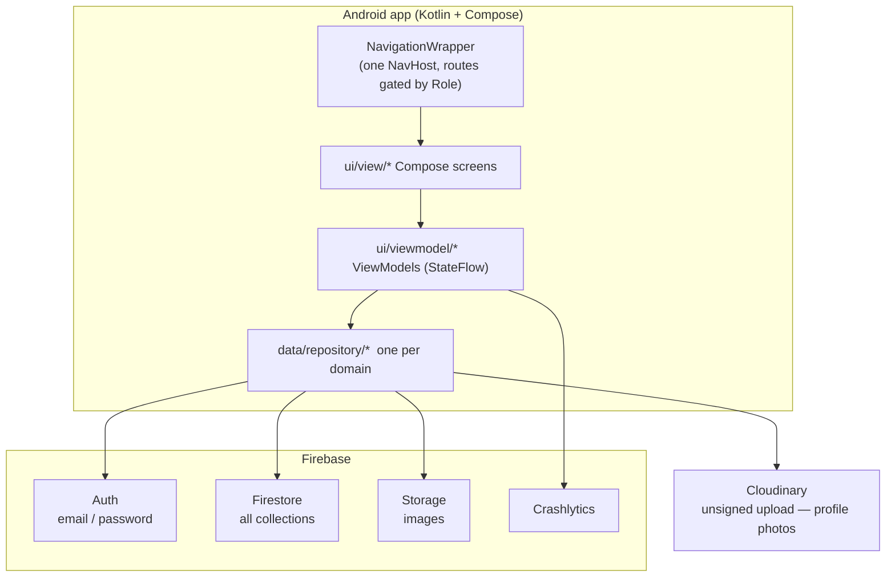
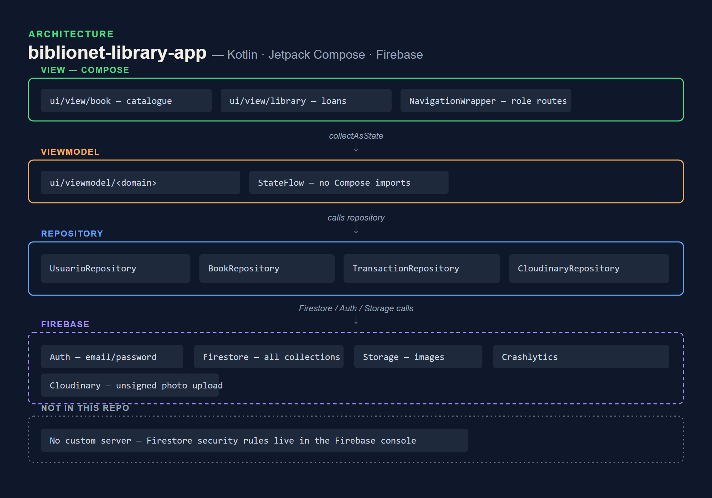

# Architecture

BiblioNET is a single-module Android app (`:app`). No backend code — Firebase is the backend.

## Layers

| Layer | Package | Responsibility |
|---|---|---|
| Model | `data/model/<domain>` | Plain Kotlin data classes matching Firestore documents. Domains: `auth`, `book`, `inventory`, `library`, `transaction`. |
| Repository | `data/repository/<domain>` | The only place that touches Firestore. Exposes suspend functions / Flows. |
| Remote | `data/remote/cloudinary` | `CloudinaryService` posts a multipart image to Cloudinary's REST API and returns the `secure_url`. |
| ViewModel | `ui/viewmodel/<domain>` | Holds screen state as `StateFlow`, calls repositories, no Compose imports. |
| View | `ui/view/<domain>` | Compose screens. Collect state with `collectAsState`. |
| Navigation | `NavigationWrapper.kt` | One `NavHost`. The start destination and the available routes depend on the signed-in user's `Role`. |

## Roles

`data/model/auth/Role.kt` defines reader / librarian / admin. After sign-in the user's role is
read from their Firestore `Usuario` document and drives:

- which bottom-nav destinations exist,
- whether book-add / inventory / reservation-management screens are reachable,
- the admin-only user-role and quiz-editor screens.

## Key flows

- **Sign-in.** `LoginViewModel` → `UsuarioRepository` → Firebase Auth, then loads the `Usuario`
  document for the role. "Remember me" writes email + password to `SharedPreferences`
  (see the known-issues note in the README).
- **Borrow a book.** `SolicitarReservaScreen` creates a `Prestamo` document in state
  `PENDIENTE`; the librarian's `GestionReservasScreen` moves it to `ACEPTADO` / `RECHAZADO`;
  the reader sees the change on their loans list.
- **Profile photo.** `ImagePicker` → `CloudinaryRepository.uploadProfileImage` → the returned
  URL is saved on the `Usuario` document; images render with Coil.
- **Find a branch.** `MapScreen` renders an osmdroid map; `MapViewModel` geocodes the search
  box and drops markers for matching `Biblioteca` documents.

## Tech

| Concern | Choice |
|---|---|
| UI | Jetpack Compose, Material 3 |
| Navigation | `navigation-compose`, single graph |
| Async | Kotlin coroutines + `Flow` |
| Backend | Firebase Auth, Firestore, Storage, Crashlytics |
| Images | Cloudinary (upload) + Coil (display) |
| Maps | osmdroid |
| Translation | Google ML Kit on-device translate |
| HTTP (Cloudinary) | OkHttp + Retrofit |
| Min / target SDK | 24 / 36 |

## What's not here

No custom server, no CI, no instrumentation tests beyond the generated stubs. Firestore security
rules and the Firebase API-key restrictions live in the Firebase console, not in this repo — a
fork needs its own project (see the README build steps).
