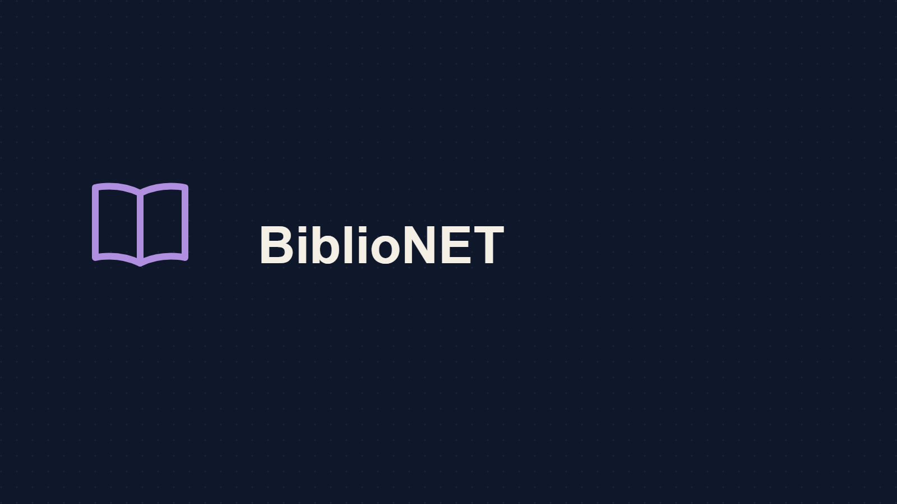
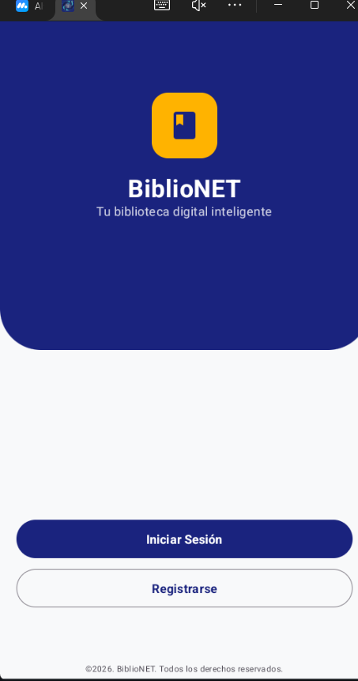

# BiblioNET


An Android app for a network of small libraries — "your smart digital library." Members browse a
shared book catalogue, borrow and reserve copies from the branch nearest them, leave ratings and
comments, and climb a reading-quiz leaderboard. Librarians manage their branch's stock and
approve reservations; admins manage users and quiz content.

Built for a DAM (software development) course module on native Android with Kotlin, Jetpack
Compose and Firebase.

## What's in it

- **Three roles.** Reader, librarian, admin — the navigation graph and screens change per role
  (`data/model/auth/Role.kt`).
- **Catalogue.** Books with categories, cover images, comments and star ratings; a personal
  favourites list and a "my books" view for readers who contribute copies.
- **Branches and stock.** Each library branch has its own inventory; a map screen (osmdroid)
  finds branches by street or city.
- **Loans and reservations.** Request a copy, librarian approves or rejects, state tracked
  through `data/model/transaction/Prestamo.kt`.
- **Reading quiz + ranking.** A gamified quiz with a global leaderboard.
- **Offline translation.** Book blurbs can be translated on-device with ML Kit.
- **Localisation.** Spanish / Catalan / English, switched at runtime (the locale is re-applied
  in `MainActivity.attachBaseContext`).

## Screenshots


:---:
The Firebase-backed login screen — signing in needs the original course project's credentials

## Architecture

MVVM, one package per domain:

```
data/
  model/        immutable data classes (Firestore documents)
  repository/   one repository per domain — all Firestore access lives here
  remote/       Cloudinary image upload (profile photos)
ui/
  view/         Compose screens, grouped by domain
  viewmodel/    one ViewModel per screen area, exposes StateFlow
  components/    shared Compose pieces (text fields, cards, headers)
  theme/        Material 3 colour / type
NavigationWrapper.kt   the single NavHost, routes gated by role
```

Firebase does the backend work: **Auth** for sign-in, **Firestore** for every collection,
**Storage** + **Cloudinary** for images, **Crashlytics** for crash reports. There is no custom
server. See [ARCHITECTURE.md](./ARCHITECTURE.md).

## Build it

Needs Android Studio (AGP 9, JDK 17+) and your own Firebase project.

1. Create a Firebase project, add an Android app with package `com.biblionet`, enable
   **Authentication** (email/password), **Firestore** and **Storage**.
2. Download its `google-services.json` into `app/`. A redacted
   [`app/google-services.json.example`](./app/google-services.json.example) shows the shape.
3. `./gradlew assembleDebug`, or open in Android Studio and run.

Cloudinary uploads use a public unsigned preset (`CloudinaryService.kt`); swap the cloud name
and preset for your own if you want profile-photo upload to work.

## Install it

A pre-built APK is attached to the [latest release](../../releases/latest) (`minSdk` 24). It
points at the original course Firebase project, which may be offline — building your own is the
reliable path.

## Known issues

Kept mostly as-is from the course submission, worth calling out:

- The Cloudinary upload preset is unsigned, so anyone with the cloud name can upload to it.
- `LoginScreen.kt` used to cache the password in `SharedPreferences` for the "remember me"
  box — fixed after the course: it now stores only the email.

## Contributors

A group project for the DAM course. Handles are GitLab, where the coursework was hosted.

- **Zakaria Elmtiouy** (@elmitouy.zakaria) — lead
- **Baye Mory** (@bmdia)
- **Marceli** (GitLab handle unknown)
- **Daniel Adanegbe** (@dadanegbe)

## License

PolyForm Noncommercial 1.0.0 ([LICENSE](./LICENSE)). Personal, non-commercial use only.
